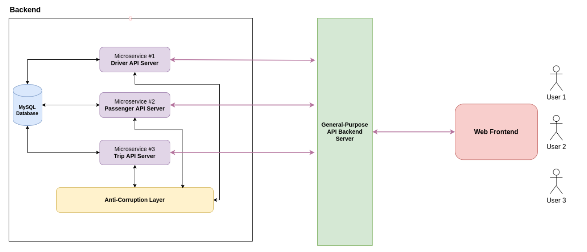

# RideSharing (ETI-Assignment1)

## Folder Structure

|       Codebase       |                Description                |                       Port numbers used (localhost)                        |
| :------------------: | :---------------------------------------: | :------------------------------------------------------------------------: |
| [frontend](frontend) |          React Next.js Frontend           |                                    3000                                    |
|  [backend](backend)  | Microservices connected to MySQL Database | **Driver**: 8080 **Passenger**: 8081 **Trip**: 8082 **ACL**: 4000 |
|   [server](server)   |    General-Purpose API Backend Server     |                                    5000                                    |

## Usage

There is a total of **6 servers** need to be started. You should be able to see `"Listening on port x ..."` after firing up the servers.

### Microservices Backend

Refer to this [README guide](backend/README.md) to start the 3 microsevice servers + 1 express server which acts as anti-corruption layer.

### General-Purpose API Backend

Refer to this [README guide](server/README.md) to start the express servers which acts as general-purpose API backend to redirect client requests to respective microservices.

### Frontend

Refer to this [README guide](frontend/README.md) to start the next.js frontend.

## Architecture Diagram

## Architecture Design Consideration

### Microservices design

The business logic from the assignment case studies breaks down into **three microservices** (driver, passenger, trip).

In general, each microservice is connected to the same MySQL database. **(Disclaimer: In real practice, each microservice should be connected to its own MySQL database. This is done to simply fulfill the assignment purposes.)** The microservice will serve a server endpoint which allows external http requests with methods (GET/PUT/POST) to retrieve, create, or update the row(s) in the backend database related to the microservice module. For example, **driver microservice** server allows for retrieving all filtered drivers with customisable query parameters at `api/v1/drivers`, and retrieving, creating, updating for a specific driver at `api/v1/driver/{driverid}`.

Each of the microservice is **fully independent from one and another**. The three microservices **serve at different localhost endpoint with different port numbers**, where the driver, passenger and trip microservices serves at 8080, 8081 and 8082 port numbers respectively.

In the case when one microservice needs to communicate with another microservices, **anti-corruption layer** is implemented between the layer in the backend to facilitate the communication.

### Anti-corruption layer

In betweeen the microservices, the **anti-corruption layer** is implemented to handle and redirect internal microservices requests. The server is written in **node.js and Express.js**.

By definition, anti-corruption layer (ACL) creates an isolating layer to provide clients with functionality in terms of their own domain model. The layer talks to the other system through its existing interface, requiring little or no modification to the other system. Internally, the layer translates in both directions as necessary between the two models. (Quoted from **Eric Evans, Domain Driven Design, 16th printing, page 365**)

In short, an ACL is not just about separating the messy code, but as a means to communicate between bounded contexts. It translates from one context to the other, so that data in each context reflects the language and the way that that context thinks and talks about the data.

In the project, the express server serves at `localhost:4000`. When one microservice wants to communicate with another microservice, the microservice only needs to send http request with related pathname, for example `api/v1/drivers`, to the server which acts as ACL. By this way the microservice would not have to explicitly call that particular microservice endpoint, which is against the domain driven design (DDD). Instead, the microservice only knows and calls one surface endpoint which will do the lifting communication work.

The usage of ACL in the project is that when the trip microservice needs to communicate with both driver and passenger microservice in order to retrieve the driver and passenger information for the trip. The trip microservice will send http request with related information to the ACL, and the ACL will redirect the requests to respective microservices and return the desired result back to the trip microservice.

In addition, the ACL will also **authenticate the bearer token** to ensure the requests are valid and sent from the legitimate microservices server. When no or incorrect token is sent, that http request will be blocked, and 403 status code which indicates access forbidden will be sent back.

### React Next.js Frontend

The frontend is written is React.js with Next.js. The frontend simulates the features of ride-sharing platform such as the user login, account creation, profile edit, creating trip, initiating or ending trip, and viewing past completed trips. Refer [here](frontend) to the screenshots of frontend.

In the case when the frontend wants to communicate with the backend server to fulfill client requests, a **general-purpose API backend server** is implemented in between the layer of frontend and backend to facilitate the communication.

### General-Purpose API Backend Server

It works similarly as ACL, but the communication takes place between the backend and the frontend.

With this generalised backend server, there would be only one server endpoint surfaced to the client. This could improve backend security by preventing abusing of the backend microservice server as those microservices server endpoint are not opened to the public.

For example, when the user wants to create a passenger account, the http request containing passenger information will be sent to the generalised server `localhost:5000`. The server will then redirect the request to the passenger microservice for the passenger account creation. The result will then sent back to the originated frontend server.

Similarly, the server will also **authenticate the bearer token** to ensure the requests are valid and sent from the frontend server. When no or incorrect token is sent, that http request will be blocked, and 403 status code which indicates access forbidden will be sent back.

## Data Structures

### Driver

|      Field Name       |  Type  |                                                                                                  Description                                                                                                  |
| :-------------------: | :----: | :-----------------------------------------------------------------------------------------------------------------------------------------------------------------------------------------------------------: |
|       driver_id       | string |                                                                                     The unique ID which identifies driver                                                                                     |
|      first_name       | string |                                                                                         The first name of the driver                                                                                          |
|       last_name       | string |                                                                                          The last name of the driver                                                                                          |
|     mobile_number     | string |                                                                                        The mobile number of the driver                                                                                        |
|     email_address     | string |                                                                                        The email address of the driver                                                                                        |
| identification_number | string |                                                              The identification number of the driver. It cannot be edited after driver creation.                                                              |
|  car_license_number   | string |                                                                                     The car license number of the driver.                                                                                     |
|   available_status    |  int   | The available status number of the driver.**  0 -> used by golang to indicate whether the integer variable has been initialised or not  1 -> Online and available  2 -> Online but during the trip** |

### Passenger

|    Field Name    |  Type  |                                                                                                  Description                                                                                                  |
| :--------------: | :----: | :-----------------------------------------------------------------------------------------------------------------------------------------------------------------------------------------------------------: |
|   passenger_id   | string |                                                                                   The unique ID which identifies passenger                                                                                    |
|    first_name    | string |                                                                                        The first name of the passenger                                                                                        |
|    last_name     | string |                                                                                        The last name of the passenger                                                                                         |
|  mobile_number   | string |                                                                                      The mobile number of the passenger                                                                                       |
|  email_address   | string |                                                                                      The email address of the passenger                                                                                       |
| available_status |  int   | The available status number of the driver.**  0 -> used by golang to indicate whether the integer variable has been initialised or not  1 -> Online and available  2 -> Online but during the trip** |

### Trip

|     Field Name      |   Type    |                                                                                                                                                                                                         Description                                                                                                                                                                                                         |
| :-----------------: | :-------: | :-------------------------------------------------------------------------------------------------------------------------------------------------------------------------------------------------------------------------------------------------------------------------------------------------------------------------------------------------------------------------------------------------------------------------: |
|       trip_id       |  string   |                                                                                                                                                                                             The unique ID which identifies trip                                                                                                                                                                                             |
|    passenger_id     |  string   |                                                                                                                                                                                          The unique ID which identifies passenger                                                                                                                                                                                           |
|      driver_id      |  string   |                                                                                                                                                                                            The unique ID which identifies driver                                                                                                                                                                                            |
| pickup_postal_code  |  string   |                                                                                                                                                                                             The pickup postal code of the trip                                                                                                                                                                                              |
| dropoff_postal_code |  string   |                                                                                                                                                                                             The dropoff postal code of the trip                                                                                                                                                                                             |
|    created_time     |  string   |                                                                                                                                                                                                The created time of the trip                                                                                                                                                                                                 |
|   completed_time    |  string   |                                                                                                                                                                                   The completed time of the trip. Initially was set as 0.                                                                                                                                                                                   |
|    trip_progress    |    int    | The trip progress of the trip.**  0 -> used by golang to indicate whether the integer variable has been initialised or not  1 -> Created by passenger, but no driver is found to be assgined 2 -> A driver was already assigned for the trip, but the driver has not inititated the trip yet 3 -> The trip is ongoing (Driver has initiated the trip)  4 -> The trip has ended (Driver has ended the trip)** |
|      passenger      | Passenger |                                                                                                                                                             The passenger object of the trip. This field is used when returning results to the frontend server.                                                                                                                                                             |
|       driver        |  Driver   |                                                                                                                                                              The driver object of the trip. This field is used when returning results to the frontend server.                                                                                                                                                               |

## **Credits**

<table>
  <tr>
    <td align="center"><a href="https://github.com/hwennnn"> <b>Wai Hou Man   (S10197636F) </b></a> 
    </td>
  </tr>
</table>
